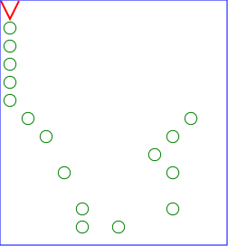

# Genetic Algorithms
My 8th grade daughter wanted to create a science display for school. Not a science fair, but somthing a small group could research, learn and present. After several discussions, we started looking at genetic algorithms with the thought "that's cool."

I offered to help them with the code, but they had to help with the broad design of their playground.  They decided on a trail their virtual bloodhound would have to find and follow. So here is the environment they created.

 * The bloodhound could only tell if there was a scent marker directly in front, the direction it is facing.
 * Actions were limited to: turn left, turn right, and move straight ahead; which we encoded as 'L', 'R', 'F'.

From here, we talked about programing a state machine of a fixed size.  We always started at location (0,0) looking towards (0,1) at state 0.  We used the following state table with a total of 24 different states to help the kids visualize how the process worked.

State | Action with scent | Action without scent | Next state
------|-------------------|----------------------|-----------
 0    | L, R, or F        | L, R, or F           | 0 - 23
 1    | L, R, or F        | L, R, or F           | 0 - 23
 ...  | L, R, or F        | L, R, or F           | 0 - 23
 23   | L, R, or F        | L, R, or F           | 0 - 23

Now each chromosone was a series of 24 [with scent, without scent, next action]. We drew out some sample chromosones and talked about crossing two chromosones and using mutation as factors of creating new and possibly better chromosones.  Because they got bored after filling in a state table at around state 7, and since the whole purpose was to let the computer create the solutions, we randomly created the chromosones.

Now each person had to provide the following for the command-line:

 * --gen: The maximum number of generations before stopping to find a solution.
 * --pop: The population size every generation.
 * --steps: Maximum number of actions before the fitness function quits.
 * --promote: Percent of top ranked population to keep.
 * --cross: Percent of next population by cross breeding the top ranked.
 * --mutate: Percent of top ranked population to mutate.
 * --rate: Probability to mutate an input state.
 * --action: Probability to mutate a state's action.
 * --state: Probability to mutate the next state action.

The results of these runs were kept in a SQLite database.  We kept a record of all our runs and saw that even with the same starting conditions, the end result would vary because of our use of randomly generated chromosones and mutation.

## Results

The computer would print out the number of actions before a solution was found which completed the scent trail.  The kids were a bit underwhelmed by just a number.  They needed some visualization.  I created `imager.py` which created a series of images showing how the
virtual bloodhound searched the field. They giving all these images to `image2gif`, I now had an image the kids could not only see, but use to demonstrate the outcome of some of their most successful and worst wonderings.

